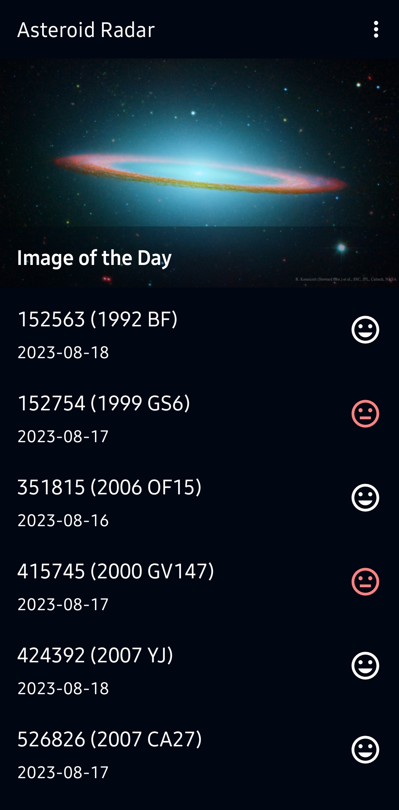
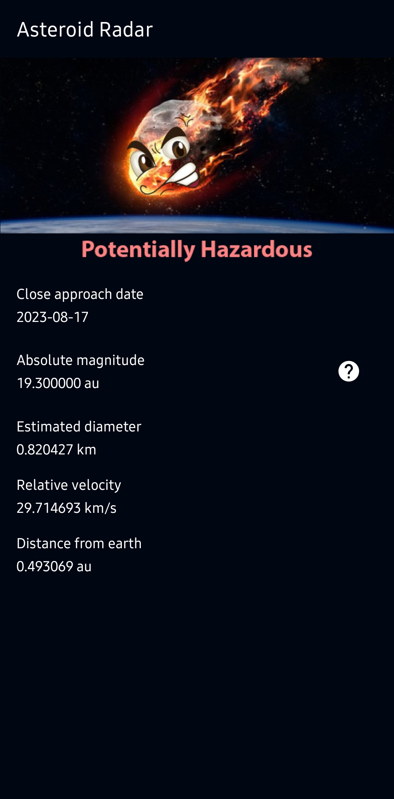

# AsteroidRadar
Displays a list of asteroids and if they are potentially hazardous, providing more details when one is tapped.
Part of the Advanced Android Kotlin Development nanodegree from Udacity.

|Home|Detail|
|:---:|:---:|
|||

Topics:
- Retrofit
- WorkManager
- MVVM
- Repository Pattern
- Room
- RecyclerView
- Data Binding
